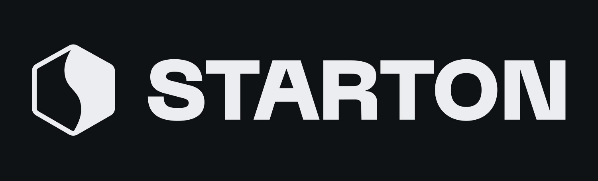

<p>
  <a target="https://starton.io"></a>
</p>

# Deploy your first blockchain bot using Starton

## Introduction

This repo is related to an [Epitech](https://www.epitech.eu/) workshop led by [Starton](https://starton.io).</br>
This workshop will allow you to build your first (or not) Discord bot connected to the blockchain using Starton (it's very easy you'll see).</br>
During the 2 following hours, you'll develop a Discord bot in NodeJS thanks to what you can airdrop NFTs to the users of your Discord server.</br>

### What is Starton ?

Starton is a (wonderful :eyes:) start-up that provide developers an easy way to interact with the blockchain through their API.</br>
With only few lines, you can automatically deploy a smart-contract, launch an NFT collection, follow the activity of [Vitalik Buterin](https://fr.wikipedia.org/wiki/Vitalik_Buterin) and so on, **without think about the blockchain complexity** (the [nonces](https://www.investopedia.com/terms/n/nonce.asp#:~:text=In%20cryptocurrency%2C%20a%20nonce%20is,to%20receive%20the%20block%20reward.), the [gas fees](https://www.moonpay.com/learn/defi/what-are-ethereum-gas-fees), etc).

## Let's start !

### Step 0 - Requirement & Configuration

#### Fork the repository

For the needs of the workshop, you'll need to fork the GitHub repository on your profile.</br>
This will help us to mark you as present.
Please, fork it as a public repository, or we could not access to it, and you'll be marked as absent.

Hint : https://docs.github.com/en/get-started/quickstart/fork-a-repo

Then, clone the repository on your local machine.

```bash
git clone git@github.com:starton-io/deploy-your-first-discord-blockchain-bot.git
```

#### Create a Starton account

To interact with the blockchain, you'll use the Starton API, so you'll need to create an account.

Go on [app.starton.io](https://app.starton.io) and create your account (with your Epitech email address, maybe some gifts will be drop :eyes:).

Generate an API key that will be useful to use our API.

Hint : https://docs.starton.io/docs/getting-started

#### Register on Discord Developer Portal

As we will create a Discord Bot, you'll need to create  new application on the [Discord Developer Portal](https://discord.com/developers/applications)</br>
Generate a new token that you'll put in your future application.

Hint : https://discordjs.guide/preparations/setting-up-a-bot-application.html#creating-your-bot

### Step 1 - Initialization

Now that you cloned the repository, you need to initialize it.
For this, we will use [NodeJS](https://nodejs.org/en) with [Yarn](https://yarnpkg.com/) as package manager.

```bash
yarn init
```

Some packages are also required to use the Discord API and to send HTTP requests, you need to install them.
```bash
yarn add axios discord.js dotenv
```
**[axios](https://axios-http.com/fr/docs/intro)** is used to send request to any API</br>
**[discord.js](https://discord.js.org/#/docs/discord.js/main/general/welcome)** is used to use the Discord API</br>
**[dotenv](https://www.npmjs.com/package/dotenv)** is used to store environment variable securely</br>

You will then need to create two files :
- The first one called `starton.js`
- The second one called `discord.js`

You also have in the repository a file called `.env.example`. It looks like this :
```bash
## Put your Starton API key on the following line (it begins with 'sk_live_...')
STARTON_API_KEY=

## Put your Discord Bot Token on the following line
BOT_TOKEN=
```
Rename it as `.env` and store in the file :
- Your Starton API key in the field `STARTON_API_KEY`
- Your Discord Bot token in the field `BOT_TOKEN`

You can then configure dotenv in both files and display the right environment variables to see if they are imported as expected.

Hint 1 : https://www.npmjs.com/package/dotenv </br>
Hint 2 : https://developer.mozilla.org/fr/docs/Web/API/console/log

You can run your scripts with :
```bash
## To run Starton script
node starton.js

## To run Discord script
node discord.js
```

### Step 2 - IPFS

[IPFS](https://fr.beincrypto.com/apprendre/ipfs-presentation-comment-ca-marche/) is a distributed storage system that works in peer-to-peer.
This means that once a file is stored on IPFS, as the data is duplicated, the file (or the folder) can't be deleted, or should be deleted on every node of the network that hosts the file.

This system has been built to avoid the censor and to be sure that our data are persistent.

For example, if you have a Google account, your data are stored on the Google's servers. It means that if you are an enemy of Google, they can block your account as they want and also, if they have a technical issue (like some burning datacenters) you can lose your data.

This scenario is not possible with IPFS.

It's the perfect technology for us : we want the picture and the metadata of our NFT persistent.

For that, you will upload on IPFS **thanks to the Starton dashboard**, the file called `starton-nft.png` in the `assets/` folder of this repository.</br>
This picture will be the content of our NFT.</br>
Then, get de CID (Content IDentifier) of your picture and put it in the `starton-nft-metadata.json` file.</br>
Your file looks like this :
```json
{
  "name": "Starton x Epitech NFT",
  "description": "This NFT has been minted for the Starton x Epitech Workshop",
  // PUT YOUR IMAGE CID ON THE FOLLOWING LINE
  "image": "ipfs://ipfs/YOUR_IMAGE_CID",
  "attributes": {
    "size": "42",
    "media": "Picture",
    "type": "NFT",
    "date": "March, 29 of 2023",
    "company": "Starton"
  }
}
```

Then, upload the `starton-nft-metadata.json` content on IPFS **in the JSON section**.</br>
This will be the metadata of your NFT, in other words, all the information related to our NFT (the IPFS picture link, the NFT name, the NFT description, the type, the probability to get it, etc).

**It's this CID that we will put in NFT parameter.**

Hint : https://docs.starton.io/docs/IPFS/uploading-json

### Step 3 - Deploy your first Smart-Contract

Congrats ! Your file is now uploaded on IPFS.

We will use the Starton Dashboard for this step too. :wink:

You will here deploy your first smart-contract. The smart-contract will allow you to create your NFT collection thanks to the cryptocurrency you own on our wallet.


Obviously, you will need to create a Wallet on the Starton's KMS in the appropriate section ("Wallet" section).</br>
Then, let's deploy a Smart Contract in the eponym section.

Select `Deploy with template` > `ERC721 NFT Smart Contract`.

1. Give a Name to your Smart Contract
2. Give it a Description
3. Give it the name you want to appear on the Blockchain
4. Give it the symbol (for example, ETH is the symbol of Ethereum)
5. Then, the Base URI token is the type of storage you want to give, here as I told you before, we will use IPFS, so, write `ipfs://ipfs/` in the text field
6. In the Initial Contract URI, put the CID of the **metadata** you uploaded on IPFS
7. And finally, set the Initial owner with the address of the wallet your just created

Next step, choose the network and the wallet :
- Select `Polygon Mumbai` in the Network field.
- Choose then your default wallet as the signer wallet. The signer wallet is the wallet that will pay the fees of the deployment of the NFT.

And... **DEPLOY** !

Here you are, you successfully deployed a NFT smart-contract... but you don't have NFT yet... Let's fix this !

Hint 1 : https://docs.starton.io/docs/Tutorials/deploy-Nfts-with-Binance </br>
Hint 2 : https://docs.starton.io/docs/Smart-contract/ERC721-Meta

### Step 4 - Mint NFT

Mint is the action to 'create' an NFT. When you mint an NFT, you have the choice to mint it on every address you want.</br>
In our case, we want to mint the NFT on the wallet of our Discord users.

We will first mint an NFT using the Starton Dashboard to understand how it works and then using API.

#### Dashboard minting

So, check the Smart Contract section, click on the smart contract you just deployed and on the right, click on the `Interact` tab.</br>
You will see lots of things appear on the left. Those things are all the function of the smart contract. </br>
Using the search bar, write `mint` and then click on the concerned function.

Fill the fields with the following information :
- Use your newly created wallet.
- In the `to` field, copy and paste you wallet too (this is a test, after, it will be the user's wallet).
- And in the `URI` field, put the CID of the metadata file you uploaded on IPFS.

Now that you created your first NFT, you can check if it is really visible on the blockchain, for that, visit one of the following link and search the address of your contract:
- Element [Testnet] : https://testnets.element.market/polygon
- Opensea [Testnet] : https://testnets.opensea.io/

#### API minting

First NFT deployed : CHECK

It's time to automate it... with the Starton API.

Setup your `starton.js` file with axios, and try to find a way to mint directly with your script (look at the hints they are useful).

You can run your script with :
```bash
node starton.js
```

Hint 1 : https://docs.starton.io/docs/Developer/Discovering-coding-interface#code </br>
Hint 2 (less interesting) : https://reflectoring.io/tutorial-guide-axios/

### Step 5 - Detect Discord command

Okay good, you can mint lots and lots of NFTs on every wallet you want.

Let's take a look on the Discord side.

First, setup your Discord Bot instance.

Hint 1 : https://discordjs.guide/creating-your-bot/main-file.html#running-your-application

We want that when executing the following command in the chat, the Bot reply `Hello World !` :
```bash
/airdrop
```

Hint 2 : https://discordjs.guide/creating-your-bot/slash-commands.html#before-you-continue

You can run your script with :
```bash
node discord.js
```

### Step 6 - Get Discord command content

Well done ! You know how to interact with the Discord chat and make your users send commands to the bot.

What we really want is to get the wallet of the Discord user to mint an NFT on their address.

Here is a desired example :
```bash
/airdrop 0xA76ed24122193CF53f81F6dBEbE2a1DfF8f9e902
```

**DISCLAIMER :** This is a good way to test but it's not secure for production project. Metamask is a better way to do this but we won't use it now.

You can run your script with :
```bash
node discord.js
```

Hint : the word `data`

### Step 7 - Link both and have fun

It's almost the end !

Now that you know how to mint an NFT on a wallet and that you know how to get the content of a Discord command (so... the wallet) you just have to link both to make magic happens...

And voilà ! All is working !

You should run the following final command :
```bash
node discord.js
```

### Step ∞ - The only limit is your imagination

Now that you finished the workshop, be free to continue to use Starton, to develop projects and to build application using the (incredible) blockchain technology.

## Documentation

You can access to the Starton Documentation here : [Starton Documentation](https://docs.starton.io)</br>
If you need test faucet, you can get some on the official Polygon Faucet : [Polygon Mumbai Faucet](https://faucet.polygon.technology/)

## Authors

**Tibo Pendino** - _Backend Developer @starton.io_ ([GitHub](https://github.com/tibo-pdn), [LinkedIn](https://www.linkedin.com/in/tibo-pendino/))